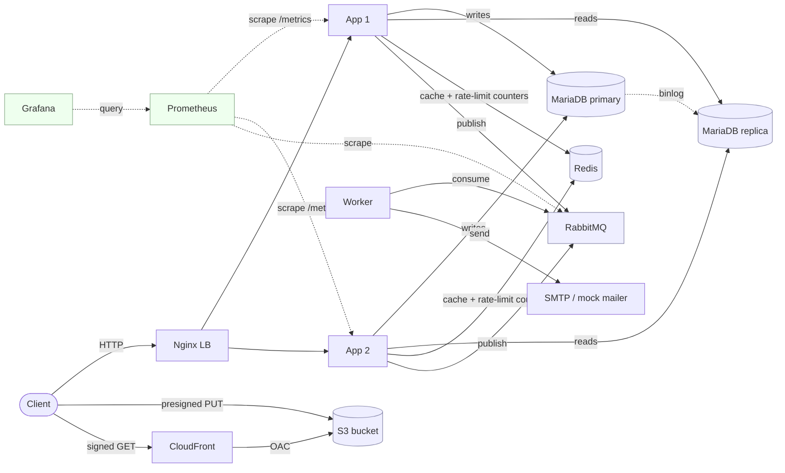

# StudentSystemGo

> A Go REST API I built to learn production system design from first principles. Each capability — read replicas, rate limiting, async workers, observability, IaC — solves a specific failure mode. I added them one at a time, broke things on purpose, and documented what I learned.

## What it does

School management API. CRUD over students, teachers, execs (administrators). Auth via JWT. Profile photo uploads via S3 + CloudFront signed URLs. Password reset emails handled async via RabbitMQ.

That's the surface area. The interesting part is **how the system handles itself** under each kind of failure.

## The numbers

Load tested with k6 against a local stack mirroring production:

- **Throughput**: 475 RPS sustained at 50 concurrent users
- **Latency**: p50 = 27ms, p95 = 140ms, p99 < 1s
- **Error rate**: 0% across 156k requests in a 5.5-minute ramp
- **Production posture** (rate-limited, 100/min/IP): correctly throttles excess load — verified end-to-end on EC2

The full test methodology and per-endpoint breakdowns are in [docs/load-testing.md](docs/load-testing.md).

## Architecture (the 30-second version)



AWS resources (S3, IAM, CloudFront): managed via Terraform. Drift detection on `terraform plan`. ASCII fallback in [docs/architecture.md](docs/architecture.md).

Deeper dive: [docs/architecture.md](docs/architecture.md).

## Stack

| Layer | Tech | Why this choice |
|---|---|---|
| Language | Go 1.25 | Single static binary, fast HTTP, simple concurrency |
| HTTP | stdlib `net/http` + Go 1.22 routing | No framework, no magic, deliberately verbose |
| DB | MariaDB 11 | Free, GTID-based replication, well-understood |
| Cache | Redis 7 | Standard for cache-aside + rate-limit counters |
| Async | RabbitMQ 3.13 | Per-queue durability, DLX-based dead lettering |
| Object storage | S3 + CloudFront | Presigned PUT (uploads bypass app), signed GET via CDN |
| Observability | Prometheus + Grafana | Pull-based metrics, the 4 golden signals dashboard |
| IaC | Terraform | All AWS resources imported and managed |
| CI/CD | GitHub Actions | Lint → build → push to ghcr.io → SSH-deploy |
| Runtime | Docker Compose on EC2 t3.micro | Single-host pragmatism; planned k3s migration |

## Why this exists

I'm a backend engineer aiming at platform / AI infrastructure / agentic engineering roles. Most tutorials teach a feature in isolation; production demands the layered approach where each piece interacts with the others.

So I built each layer **deliberately** — write a hello-world API, then add Docker, then CI/CD, then a load balancer, then a rate limiter, then a read replica, then caching, then async work, then observability, then IaC, then load test the whole thing. After each layer, I explained back what I'd built and why.

The result is a system I genuinely understand end-to-end, with failure-mode notes for every component.

## How I built it (12 steps)

| Step | What it added | Why |
|---|---|---|
| 1 | Dockerized app + DB | Reproducible local dev |
| 2 | GitHub Actions CI | Fail-fast on broken commits |
| 3 | Auto-deploy to EC2 | One-command production |
| 4 | Nginx LB + N app instances | Horizontal scale-out, blast-radius isolation |
| 5 | Redis-backed rate limiting | Distributed state across LB instances (no N×bypass) |
| 6 | MariaDB primary + replica + read/write split | Read scale, latency reduction, future failover |
| 7 | Redis cache-aside | DB load reduction on hot reads |
| 8 | S3 + CloudFront for photos (+ Terraform) | Bandwidth offload, IaC-managed AWS |
| 9 | RabbitMQ + worker for async work | Email sending decoupled from request path |
| 10 | Prometheus + Grafana | Metrics + dashboards (the 4 golden signals) |
| 11 | k6 load tests | Real numbers, not theoretical claims |
| 12 | This writeup | The artifact |

## Lessons I want to highlight

A handful of decisions that shaped the project. Each is something I had to think through, not just look up:

- **Rate-limit counters belong in Redis**, not in-process. Otherwise N app instances allow N × the configured limit. ([deep dive](docs/observability.md#rate-limiting))
- **Cache invalidation is "write-through delete"**, not "write-through update". Simpler, fewer race conditions. ([cache-aside notes](docs/architecture.md#cache-aside))
- **Asymmetric crypto** for CloudFront signed URLs vs **HMAC** for S3 presigned URLs — different threat models, both have to live in the same app. ([photo flow](docs/photo-flow.md))
- **At-least-once delivery** is the practical contract, not "exactly-once." Build handlers idempotent. ([queues](docs/architecture.md#async-work))
- **Migrations are load-bearing** — fail-closed at startup. Cache misses are not — fail-open. The blast-radius lens is the deciding factor. ([deployment notes](docs/deployment.md#failure-modes))
- **Terraform import** is the safe way to adopt existing AWS resources. Plan with `terraform plan`, fix code drift before applying, never blindly apply. ([deployment](docs/deployment.md#terraform))

## Honest caveats

A learning project, not a finished product. Things I deliberately punted on:

- **No HTTPS at the edge** — EC2 serves plain HTTP. Production deploy would terminate TLS at the LB.
- **Compression middleware has a bug** — appends gzip bytes after the JSON response without setting `Content-Encoding`. Most clients tolerate it; strict ones (k6) don't. Logged for follow-up.
- **No real email** — worker uses a mock mailer that logs to stdout. Wiring SES/SendGrid is a config swap.
- **No alerting** — Prometheus collects, Grafana visualizes; nothing pages me when things break.
- **Memory-bound on t3.micro** — ramp test (50 VUs) was run locally, not against EC2 prod. Documented in [load-testing.md](docs/load-testing.md).
- **/metrics is publicly exposed** — fine for a learning project; production would restrict via nginx allowlist or basic auth.

I list these on purpose: a senior engineer can see what's missing as well as what's there.

## Local dev

```bash
git clone https://github.com/omkar619-dev/StudentSystemGo
cd StudentSystemGo
cp .env.example .env  # fill in DB_PASSWORD, JWT_SECRET, etc.
docker compose up -d --build
```

Visit `http://localhost:3000/healthz`. App on `:3000`, RabbitMQ UI on `:15672`, Grafana on `:3001`, Prometheus on `:9090`.

Detailed walkthrough: [docs/deployment.md#local-development](docs/deployment.md#local-development).

## Production

Public deploy: `http://13.126.165.62/healthz`

Deploy lives on AWS EC2 (Mumbai region, t3.micro, free tier). Auto-deploys on every push to `main` via GitHub Actions. AWS resources (S3, IAM, CloudFront) managed via Terraform in [`infra/terraform/`](infra/terraform/).

Detailed deploy walkthrough: [docs/deployment.md](docs/deployment.md).

## Load testing

Two scenarios in [`load-tests/`](load-tests/):

- `01-baseline.js` — 1 VU for 60s. Establishes ideal-case latency.
- `02-ramp.js` — 5 → 25 → 50 VUs over 5 min. Finds degradation points.

```bash
k6 run -e BASE_URL=http://localhost:3000 \
       -e LOGIN_USERNAME=... -e LOGIN_PASSWORD=... \
       load-tests/scenarios/02-ramp.js
```

Full results + analysis: [docs/load-testing.md](docs/load-testing.md).

## Repository tour

```
.
├── cmd/
│   ├── api/                 # HTTP server entry point (cmd/api/server.go)
│   └── worker/              # async worker entry point (cmd/worker/main.go)
├── internal/
│   ├── api/                 # handlers + middlewares + router
│   ├── cache/               # Redis cache-aside helper
│   ├── dbmigrate/           # golang-migrate runner
│   ├── mailer/              # interface + mock impl (real SMTP later)
│   ├── metrics/             # Prometheus instrumentation + middleware
│   ├── queue/rabbitmq/      # AMQP client, publisher, consumer, topology
│   ├── redis/               # Redis singleton
│   ├── repository/sqlconnect/  # DB layer (read/write split)
│   └── storage/photo/       # S3 presign + CloudFront signed URL
├── infra/terraform/         # IaC for AWS resources (S3, IAM, CloudFront)
├── monitoring/              # Prometheus config + Grafana dashboards
├── load-tests/              # k6 scenarios + auth helper
├── mysql/                   # primary.cnf, replica.cnf, init scripts
├── docs/                    # deep-dive documentation
└── docker-compose.yml       # local dev (full stack)
└── docker-compose.prod.yml  # production (no monitoring stack — see docs/deployment.md)
```

## Deep dives

- [Architecture](docs/architecture.md) — the layered design, decision-by-decision
- [Observability](docs/observability.md) — Prometheus, the 4 golden signals, PromQL idioms
- [Deployment](docs/deployment.md) — Docker, CI/CD, EC2 setup, Terraform workflow
- [Load testing](docs/load-testing.md) — methodology, results, interpretation
- [Photo flow](docs/photo-flow.md) — S3 presigned PUT + CloudFront signed GET, end-to-end

## What's next

- **Phase 1.5**: redeploy on k3s. Same workloads, same observability, just on Kubernetes — preparing for the platform-engineer role bar.
- **News Feed project**: Go + Postgres + pgvector. Self-hosted on a homelab via Cloudflare Tunnel. Real-world parallel: HN / Reddit-style ranked feeds.
- **AI agent project**: TypeScript + LangGraph with an eval harness — the bridge to agentic engineering work.

## Contact

Built by Omkar Shendge — backend engineer aiming at platform / AI infra / agentic engineering roles.

[GitHub](https://github.com/omkar619-dev) · [omkarshendge619@gmail.com](mailto:omkarshendge619@gmail.com)
