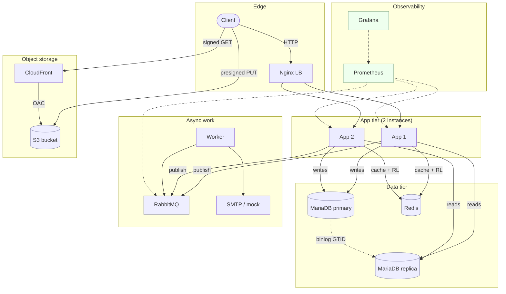

# Architecture

The system is built in 12 deliberate layers. Each layer answers a specific failure mode that surfaces in production. This doc explains each layer — what it does, why it was added, and what would break without it.

## Diagram (full)



ASCII fallback if Mermaid doesn't render in your viewer:

```
                          ┌─────────────────────────────────┐
                          │     Internet                     │
                          └────────────────┬─────────────────┘
                                           │
                                       ┌───▼────┐
                                       │ Nginx  │  load balance, circuit-breaker on app outage
                                       └─┬──┬──┘
                                         │  │
                              ┌──────────┘  └──────────┐
                              ▼                         ▼
                       ┌──────────┐              ┌──────────┐
                       │ App 1    │              │ App 2    │
                       │ (Go)     │              │ (Go)     │
                       └─┬─┬─┬─┬─┬┘              └─┬─┬─┬─┬─┬┘
                         │ │ │ │ │                  │ │ │ │ │
       ┌─────────────────┘ │ │ │ │                  │ │ │ │ └─────────────────┐
       │      ┌────────────┘ │ │ │                  │ │ │ └────────┐          │
       ▼      ▼              │ │ │                  │ │ │          ▼          ▼
  ┌────────┐ ┌─────┐         │ │ │                  │ │ │     ┌────────┐ ┌────────┐
  │MariaDB │ │MariaDB│        │ │ │                  │ │ │     │ Redis  │ │RabbitMQ│
  │primary │ │replica│◀──────┼─┘ │                  │ │ │     └────────┘ └────┬───┘
  └────────┘ └───────┘ binlog │   │                  │ │ │                     │
                       (GTID) │   │                  │ │ │                     ▼
                              │   │                  │ │ │                ┌────────┐
                              │   │                  │ │ │                │ Worker │
                              │   │                  │ │ │                └────────┘
                              ▼   ▼                  ▼ ▼ ▼
                          (writes) (reads)        (publish) (cache + rate-limit counters)

  Browser ──signed GET──▶ CloudFront ──OAC──▶ S3 (private bucket, photos/*)
  Browser ──presigned PUT─────────────────▶ S3 (uploads bypass app)

  Prometheus ──scrape /metrics──▶ App1, App2, RabbitMQ exporter
  Grafana ──query──▶ Prometheus
```

---

## The 12 layers, decision-by-decision

### Step 1 — Dockerize app + DB

**Problem solved**: "works on my machine" issues. Reproducibility across dev / CI / prod.

**Decisions**:
- Multi-stage Dockerfile (builder + runtime). Final image ~25 MB.
- Run as non-root user (`appuser` uid 1000). Defense-in-depth against container escape vulnerabilities.
- `CGO_ENABLED=0` for fully static binary — works on Alpine without glibc.

**Without this**: every dev had a slightly different DB version, every deploy was manual.

### Step 2 — GitHub Actions CI

**Problem solved**: lint/typo bugs reaching prod. Deploy fear.

**Decisions**:
- 3-job pipeline: lint+test → build+push image → deploy.
- Image tags: `:latest` (rolling), `:sha-<commit>` (immutable), `:main` (branch).
- Caught real bugs early: missing JSON tag quotes, `fmt.Errorf` with non-constant format strings.

**Without this**: every commit could break prod silently.

### Step 3 — Auto-deploy to EC2

**Problem solved**: bus factor on me-typing-deploy-commands.

**Decisions**:
- `appleboy/ssh-action` from CI runner.
- `--remove-orphans` flag in `compose up` cleans up stale containers from prior deploys.
- Restart Nginx after deploy because it caches DNS at startup — if app containers got new IPs, Nginx routes to the old ones until restart.

**Without this**: drift between Git state and prod state.

### Step 4 — Nginx load balancer + multiple app instances

**Problem solved**: single-app-instance = single point of failure.

**Decisions**:
- Strategy: `least_conn` (route to instance with fewest active connections).
- Circuit breaker: `max_fails=2 fail_timeout=10s`. After 2 failures in 10s, instance is removed from rotation for 10s.
- `proxy_next_upstream` retries the request on the next instance if the chosen one fails.

**Without this**: one app crash = full outage.

### Step 5 — Redis-backed rate limiting <a id="rate-limiting"></a>

**Problem solved**: in-process rate limiters allow N × the configured limit when running N instances behind an LB. Each instance enforces its own counter; shared traffic isn't shared state.

**Decisions**:
- Fixed-window counter: `INCR` + `EXPIRE` on first hit. Atomic via Redis pipeline.
- Two policies: `global` (100/min/IP, all routes) + `login` (10/min/IP, only `/execs/login` for brute-force defense).
- Fail-open on Redis error. Rate limiting is protection; loss-of-protection is acceptable degradation. Loss-of-service (closing the gate when Redis is down) is not.

**Without this**: 2 app instances × 100 req/min limit each = 200 req/min effective, twice what you configured.

### Step 6 — MariaDB primary + replica + read/write split

**Problem solved**: read-heavy workloads bottleneck on the same DB instance handling writes.

**Decisions**:
- GTID-based replication (`MASTER_USE_GTID=slave_pos` in MariaDB). Way easier than binlog+position tracking.
- Two `*sql.DB` pools in the app: `Write` (primary) and `Read` (replica). Functions explicitly pick one.
- Login (`GetUserByUsername`) stays on primary. Auth state is consistency-sensitive; a fraction-of-a-second-stale replica could let a just-disabled user log in.
- All listing endpoints use replica.

**Quirks worth knowing**:
- MariaDB has no `super_read_only` — that's MySQL-only. We rely on `read_only=ON` + app discipline. Root user with SUPER could write to replica; we trust ourselves not to.
- `gtid_strict_mode=ON` is correct but interacts badly with replica's startup transactions (the `MARIADB_DATABASE` env var creates the schema on replica before replication starts → out-of-order GTID). Fix: `RESET MASTER;` at the top of replica's init script to clear its own GTID counter before binding to primary's.

**Without this**: read latency tied to write activity. No future failover path.

### Step 7 — Redis cache-aside <a id="cache-aside"></a>

**Problem solved**: every list-endpoint hit goes to DB. Even a cheap query at 100 RPS adds up.

**Decisions**:
- Cache-aside pattern (read-through, write-around). On read: check cache → on miss, load from DB → store in cache.
- TTL: 5 min default. Short enough that stale reads are bounded; long enough to absorb traffic.
- Invalidation: **write-through delete**, not write-through update. After any mutation, delete the cache key. Next reader repopulates. Simpler, fewer race conditions than trying to keep cache in sync via writes.
- Pattern-based invalidation via `SCAN` (not `KEYS` — `KEYS` blocks Redis on large keyspaces).

**Without this**: hot lists hammer the DB on every request.

### Step 8 — S3 + CloudFront for photo uploads + Terraform

**Problem solved (object storage)**: photo uploads through the app eat bandwidth, RAM, CPU. Hosting MBs of binary data on EC2 is expensive and slow.

**Solution**:
- **Presigned PUT URL**: app generates a signed URL, hands it to client. Client uploads DIRECTLY to S3 via the URL. App's bandwidth never touches the file.
- **CloudFront signed GET URL**: bucket is fully private. App generates short-lived (5 min) signed URLs for reads. CloudFront verifies signature at the edge; if invalid → 403 before even hitting S3.
- **Origin Access Control (OAC)**: CloudFront → S3 connection signed with SigV4, verified by bucket policy. Bucket trusts only this specific distribution.

Two different signing schemes coexist:
- **S3 presigned URL**: HMAC-SHA256, signed with IAM credentials. Symmetric key.
- **CloudFront signed URL**: RSA-SHA1, signed with private key. Asymmetric — CF holds public key for verification.

Detail on the full flow: [photo-flow.md](photo-flow.md).

**Problem solved (Terraform)**: clicked-into-existence AWS resources have no audit trail, no version control, no drift detection.

**Decisions**:
- Imported existing console-created resources via `terraform import`. Wrote `.tf` files mirroring AWS reality. Used `terraform plan` to verify zero destructive changes before `apply`.
- Two AWS providers: default (`ap-south-1`) for S3/IAM, aliased `aws.cloudfront` (`us-east-1`) for CloudFront (which is global but managed via the us-east-1 control plane).
- `default_tags` on the provider — every resource gets `Project`, `Owner`, `ManagedBy`, automatically.
- `lifecycle { ignore_changes = [encoded_key] }` on the CloudFront public key. The PEM file's CRLF/LF line endings differ between local disk and AWS storage, which would otherwise trigger a forced replacement on every plan.

**Without this**: AWS drift goes undetected. Disaster recovery means clicking through the Console while production burns.

### Step 9 — RabbitMQ + worker for async work <a id="async-work"></a>

**Problem solved**: synchronous email-sending blocks the request path. Slow SMTP = slow API. SMTP outage = endpoint failure.

**Architecture**:
```
HTTP handler → publish to queue → return 202 to user (~10ms)

(meanwhile, in worker process)
  consume from queue → call mailer → ACK on success
```

**Decisions**:
- **Topology**: `email.password_reset` queue with DLX (`dead-letter-exchange`) routing to `email.password_reset.failed`. Failed messages sit there for human inspection; production would alert when depth > 0.
- **Durability**: durable queue + persistent messages. Both required for "messages survive broker restart."
- **At-least-once delivery**: manual ACK after handler succeeds. Worker crash mid-handler = broker re-delivers to next consumer. Duplicate is possible (worker crashes RIGHT after SMTP succeeds but BEFORE ACK) — handlers should be idempotent. Email duplicates are annoying, not catastrophic.
- **Prefetch=1**: broker hands worker one message at a time. With multi-worker setups, this distributes load fairly.
- **Mailer interface + mock impl**: real SMTP is a config swap. Worker logs to stdout for now; SES/SendGrid implementation slots in via the `Mailer` interface.

**Same-image, different-binary**: `Dockerfile` builds both `/app/server` (HTTP) and `/app/worker` (queue consumer). Compose `command: ["/app/worker"]` selects which one runs. Saves disk + simplifies CI.

**Without this**: every forgot-password = 500ms+ HTTP latency. SMTP down = endpoint failure.

### Step 10 — Prometheus + Grafana

Detailed in [observability.md](observability.md). Highlights:

- App exposes `/metrics` in Prometheus text format. Prometheus scrapes every 15s.
- Three custom metric types: `http_requests_total` (counter), `http_request_duration_seconds` (histogram), `worker_messages_processed_total` (counter).
- Histogram bucket boundaries tuned for fast Go API (1ms-5s), not the Prometheus default (5ms-10s).
- Path label uses `r.Pattern` (route template like `/students/{id}`) not raw URL — keeps cardinality bounded.
- Grafana dashboard provisioned via JSON file (declarative, git-trackable, reproducible).
- The 4 golden signals: traffic, latency, errors, saturation.

### Step 11 — k6 load testing

Detailed in [load-testing.md](load-testing.md). Two scenarios:

- **Baseline** (1 VU, 60s) — establishes ideal-case latency.
- **Ramp** (5 → 25 → 50 VUs, 5.5 min) — finds where latency degrades, where errors begin.

Real numbers and per-endpoint breakdowns in the load-testing doc.

### Step 12 — this writeup

The artifact. README + 5 deep-dive docs. Honest about what's missing.

---

## Cross-cutting design choices

### Fail-open vs fail-closed

The blast-radius lens decides which. **What fraction of requests does this dependency gate?**

| Component | Failure mode | Fraction of traffic affected | Decision |
|---|---|---|---|
| Database | Crash | 100% | Fail-closed (crash on init) |
| Migrations | Failure | 100% (future writes wrong shape) | Fail-closed |
| JWT secret | Missing | ~99% (every authed request) | Fail-closed |
| Replica | Unreachable | 0% (primary fallback) | Fail-open |
| Redis (cache) | Unreachable | 0% (DB fallback) | Fail-open |
| Redis (rate limit) | Unreachable | 0% (let traffic through, lose protection) | Fail-open |
| RabbitMQ | Unreachable | ~1% (one endpoint) | Fail-open at startup, fail-gracefully at endpoint |
| S3 / CloudFront | Unreachable | <1% (photo endpoints only) | Fail-open at startup, fail-gracefully per endpoint |
| SMTP | Unreachable | 0% (queue absorbs) | N/A — async layer handles it |

The principle: **crashing converts a partial outage into a total outage. Only crash when the partial outage is already total.**

### Memory budget on t3.micro

1 GB total, ~750 MB usable after OS + Docker daemon. Allocations:

| Service | RAM | Tuning notes |
|---|---|---|
| MariaDB primary | ~140 MB | `innodb_buffer_pool_size=64M` (down from 96M after Step 9) |
| MariaDB replica | ~140 MB | Same |
| 2× app instances | ~100 MB | ~50 MB each |
| Nginx | ~20 MB | |
| Redis | ~30 MB | Tiny dataset |
| RabbitMQ | ~200 MB | Largest single consumer |
| Worker | ~50 MB | Small Go binary |
| OS + Docker | ~200 MB | Outside Docker stats |

Total: ~880 MB. Available headroom: ~30-130 MB depending on activity. **Hit OOM during k6 ramp testing**; mitigated by tuning MariaDB and skipping monitoring stack on EC2 (run those locally instead, scraping prod over the internet).

Documented in [load-testing.md](load-testing.md). Real lesson: at this size, the next step is t3.small (2 GB) — about $15/month. Phase 1.5 will likely make this jump.

### Why no Kubernetes

Deliberate. Phase 1 was about understanding **what k8s automates**. You can't appreciate "k8s gives me self-healing rolling deploys" until you've manually fixed Nginx's stale DNS cache after an app restart and added `--remove-orphans` to your deploy script.

Phase 1.5 will redeploy the same workloads on **k3s**. Nothing about the workloads changes; just the orchestration layer.

---

## Repository tour by layer

```
.
├── cmd/api/         — HTTP server (Step 1)
├── cmd/worker/      — async consumer (Step 9)
├── internal/
│   ├── api/         — handlers + middlewares + router (Step 1)
│   ├── cache/       — cache-aside (Step 7)
│   ├── dbmigrate/   — migrations (Step 8.0)
│   ├── mailer/      — Mailer interface + mock (Step 9)
│   ├── metrics/     — Prometheus instrumentation (Step 10)
│   ├── queue/rabbitmq/  — AMQP client + topology (Step 9)
│   ├── redis/       — Redis singleton (Step 5)
│   ├── repository/sqlconnect/  — DB layer with read/write split (Step 6)
│   └── storage/photo/  — S3 + CloudFront (Step 8)
├── infra/terraform/ — IaC for AWS resources (Step 8b)
├── monitoring/      — Prometheus config + Grafana dashboards (Step 10)
├── load-tests/      — k6 scenarios (Step 11)
├── mysql/           — primary.cnf, replica.cnf, init scripts (Step 6)
└── nginx/nginx.conf — LB config (Step 4)
```
