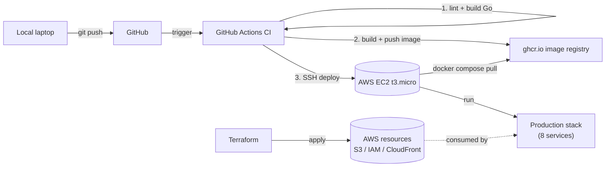

# Deployment

How code goes from your laptop to production. Covers local dev, CI/CD pipeline, EC2 setup, Terraform workflow, and the failure-mode decisions baked in along the way.

## Diagram



## Local development

### Prerequisites

- Docker Desktop (Windows/Mac) or Docker Engine (Linux)
- Go 1.25+ (only needed if you want to run/build outside containers)
- A copy of the CloudFront private key — see "Photo flow" doc for setup
- AWS credentials — `aws configure` once, never put them in `.env`

### Bring it up

```bash
git clone https://github.com/omkar619-dev/StudentSystemGo
cd StudentSystemGo
cp .env.example .env       # if .example exists; otherwise create from scratch
mkdir secrets
cp ~/.aws-keys/cloudfront_private_key.pem secrets/   # or path to wherever you stashed it

docker compose up -d --build
```

12 services should come up:
- `app` (Go HTTP server)
- `worker` (Go queue consumer)
- `mysql_primary`, `mysql_replica` (MariaDB with GTID replication)
- `redis`
- `rabbitmq` (with management UI on :15672)
- `prometheus` (on :9090)
- `grafana` (on :3001)
- `redis-exporter`, `mysqld-exporter-primary`, `mysqld-exporter-replica` (sidecars)

Verify:
```bash
docker compose ps
curl http://localhost:3000/healthz
```

### Hot iteration

Code change in Go:
```bash
docker compose up -d --build
```

The `--build` is critical. Without it, Docker reuses the cached image and your code change won't apply. (This trips up everyone the first time.)

For docker-compose.yml or .env changes:
```bash
docker compose up -d
```

For mariadb / nginx config file changes (bind-mounted):
```bash
docker compose restart mysql_primary mysql_replica nginx
```

(Bind-mounted files take effect on container restart. The image doesn't need to rebuild.)

### Common local failures

| Symptom | Cause | Fix |
|---|---|---|
| `failed to initialise photo storage` | Missing CF env vars or PEM file | Check `.env` has S3_BUCKET, CF_DOMAIN, etc.; check `secrets/cloudfront_private_key.pem` exists |
| `connection refused` on Redis | Redis container not healthy | `docker compose logs redis` |
| `Username and password are required` | API expects `username`, not `email` | Make sure your client sends `{"username":"...","password":"..."}` |
| `MissingKey` in browser when fetching photo | CloudFront signed URL expired or browser cached an unsigned URL | Generate fresh URL; hard-refresh browser |

### Without Docker

For Go-only iteration (changes to handlers, no infrastructure):
```bash
go build -o bin/server ./cmd/api
go build -o bin/worker ./cmd/worker
./bin/server   # in one terminal
./bin/worker   # in another
```

Still need Docker compose for MariaDB/Redis/RabbitMQ — the app will fail to start without them. Just keep `docker compose up -d mysql_primary mysql_replica redis rabbitmq` running and run the Go binaries directly.

## CI/CD pipeline

Defined in `.github/workflows/ci.yml`. Three jobs, gated linearly: each runs only if the previous succeeded.

### Job 1: Lint & Build

```yaml
- go vet ./...      # static analysis (catches a lot)
- go build ./...    # compiles everything
- go test ./...     # if there are tests (sparse coverage in this project; intentional for a learning project)
```

If this fails, commit doesn't deploy. Cheap fast feedback (~30s).

Real bugs this caught during development:
- Missing JSON tag closing quote: `db:"id,omitempty"` → had `db:"id,omitempty` (Go compiles, JSON serialization breaks at runtime)
- `fmt.Errorf(message)` where `message` was a runtime variable. `vet` requires constant format strings.
- `json:"page"` written as `json:page`. Compiles, doesn't serialize.

### Job 2: Docker build & push

```yaml
- docker build -t ghcr.io/omkar619-dev/studentsystemgo:latest .
- docker tag <image> ghcr.io/...:sha-${{ github.sha }}
- docker tag <image> ghcr.io/...:main
- docker push --all-tags
```

Image goes to **ghcr.io** (GitHub Container Registry — free for public repos). Three tags:
- `:latest` — rolling, points to most recent main commit
- `:sha-<7chars>` — immutable, locked to the commit
- `:main` — branch ref

Why three tags? `:latest` is what production pulls. `:sha-...` lets you roll back to a specific commit ("rollback to yesterday's image" without needing to re-build). `:main` is informational.

### Job 3: Deploy to EC2

```yaml
- uses: appleboy/ssh-action@v1.0
  with:
    host: ${{ secrets.EC2_HOST }}
    username: ubuntu
    key: ${{ secrets.EC2_SSH_PRIVATE_KEY }}
    script: |
      cd ~/StudentSystemGo
      docker compose -f docker-compose.prod.yml pull
      docker compose -f docker-compose.prod.yml up -d --remove-orphans
      docker compose -f docker-compose.prod.yml restart nginx
      sleep 5
      curl -fsS http://localhost/healthz
```

Notes on the deploy script:
- **`--remove-orphans`** — if a service was renamed/removed in compose, kill its old container.
- **`restart nginx` after pull/up** — Nginx caches DNS at startup. App containers may have new IPs after `pull && up`. Without restart, Nginx keeps trying old IPs → 502s. **This was a real bug** I hit in Step 4.
- **`curl /healthz` smoke test** — fail the CI job if the deploy didn't actually result in a working endpoint.

### GitHub Actions secrets

Three secrets configured in repo settings:

| Secret | What it is |
|---|---|
| `EC2_HOST` | Public IP `13.126.165.62` |
| `EC2_USER` | `ubuntu` |
| `EC2_SSH_PRIVATE_KEY` | Contents of `github-deploy` key (separate from personal SSH key) |

The `github-deploy` keypair is dedicated to CI — never used by humans. Public key on EC2's `~/.ssh/authorized_keys`, private key in GitHub secrets. If compromised, rotate just this key, no impact on personal access.

## EC2 setup (one-time)

Done on-record so future-you (or someone who clones the repo) can reproduce.

### Instance

- Region: ap-south-1 (Mumbai) — closest to me, lowest latency
- Type: t3.micro (free tier 12 months)
- AMI: Ubuntu 24.04 LTS
- Storage: 30 GB gp3 (also free tier)
- IAM role: `studentsystemgo-ec2-role` (Terraform-managed; grants S3 access for photo features)

### Security group rules

| Port | Source | Why |
|---|---|---|
| 22 | 0.0.0.0/0 | SSH for me + GitHub Actions deploy. (Should be tightened to known IPs in production.) |
| 80 | 0.0.0.0/0 | Public HTTP — Nginx serves the app |
| 443 | (closed) | TLS not yet configured. ACM cert + Nginx config is a polish step. |

### Software install

```bash
ssh ubuntu@<ec2-ip>
sudo apt update && sudo apt upgrade -y
curl -fsSL https://get.docker.com | sh
sudo usermod -aG docker ubuntu
# log out + in
docker --version  # verify
```

### Repository sync

```bash
git clone https://github.com/omkar619-dev/StudentSystemGo
cd StudentSystemGo
nano .env   # populate from secrets manager / your records — DB_PASSWORD, JWT_SECRET, etc.
mkdir secrets
# scp the CF private key from your laptop to ./secrets/cloudfront_private_key.pem
docker compose -f docker-compose.prod.yml up -d
```

After this point, every push to `main` redeploys automatically.

## Terraform workflow

All AWS resources are imported and managed via Terraform in `infra/terraform/`.

### Resources under management

| File | Resources |
|---|---|
| `s3.tf` | Bucket + versioning + SSE encryption + public access block |
| `iam.tf` | EC2 role + instance profile + S3 photos policy + attachment |
| `cloudfront.tf` | Public key + key group + OAC + distribution + bucket policy |

### First-time setup (already done)

```bash
cd infra/terraform
terraform init                # downloads providers
terraform import aws_s3_bucket.uploads studentsystemgo-uploads-a7k3m2
terraform import aws_iam_role.ec2_app studentsystemgo-ec2-role
# ... etc for every existing resource
terraform plan                # shows drift between code and reality
# fix any drift in code
terraform apply               # zero changes if code matches reality
```

The import workflow saved real grief — running `terraform apply` blindly on Terraform code that "describes" an existing console-created resource would attempt to **create a duplicate** instead of adopting the existing one. Import binds the existing resource to the Terraform state.

### Day-to-day

Change something in `.tf` files → `terraform plan` → review the diff → `terraform apply`.

The plan output uses these symbols:
- `+` create
- `-` destroy
- `~` modify in-place
- `-/+` destroy AND recreate (DANGEROUS — investigate why)

`-/+` is the one to watch. AWS providers force replacement on certain attribute changes (renaming a resource, changing immutable fields). Sometimes this is intentional; sometimes it's drift you can fix in code instead.

Real example we hit: an OAC name was auto-generated by the AWS Console wizard with a random suffix (`oac-...-moonvb1kz7y`). Our Terraform tried to set a clean name (`studentsystemgo-oac`). Plan showed `-/+` — destroy and recreate. Recreating breaks the CloudFront → S3 connection briefly. Fix: match Terraform code to the auto-generated name. Plan now shows zero changes.

### Lifecycle ignore_changes

The CloudFront public key has:
```hcl
lifecycle {
  ignore_changes = [encoded_key]
}
```

Why: line endings differ between the local PEM (CRLF on Windows) and AWS-stored content (LF). Without this, every `terraform plan` shows a diff on the encoded_key, which would force replacement. Replacing the public key changes its ID, breaking every signed URL in production.

`ignore_changes` is the escape hatch for cosmetic drift. Use sparingly.

### State file

`terraform.tfstate` is local (gitignored). For team setups, you'd put it in S3 with DynamoDB locking. Single-dev project, local is fine. The `.gitignore` excludes `.tfstate` files specifically.

## Failure modes

The "fail-open vs fail-closed" decisions documented in [architecture.md](architecture.md#failure-modes), but here's the deployment-specific cut.

### What happens when X fails during deploy?

| Component | Failure | Effect | Mitigation |
|---|---|---|---|
| ghcr.io | Image push fails | CI fails, no deploy attempted | Retry; rare |
| EC2 SSH | Unreachable | CI deploy step fails | Investigate (security group? WARP?) |
| `docker compose pull` | Network/registry hiccup | Deploy aborts mid-way | Re-run CI; idempotent |
| `docker compose up` | OOM kill on t3.micro | Container restart loop | Drop a service / tune memory / upgrade instance |
| migrations | Schema-incompatible | App fails to start | **App fails-closed**; orchestrator restarts; you fix the migration |
| `/healthz` smoke test | Returns non-200 | CI marks deploy failed | Investigate logs; previous image still running until next deploy |

The last point is important: a failed deploy doesn't take down the previous version. Compose's behavior is "pull new, then restart containers." If the new image fails to start, old containers keep running. Net effect: bad deploys are caught at smoke test, not in the user-facing path.

### What happens when X fails in production?

| Component | Failure | App behavior |
|---|---|---|
| MariaDB primary | Down | Writes fail with 500. Reads still work via replica. |
| MariaDB replica | Down | Reads fall back to primary (manual — we don't have automatic failover) |
| Redis | Down | Cache misses → DB; rate-limit fails-open. App keeps serving. |
| RabbitMQ | Down | Forgot-password endpoint returns 503 (correct). All other endpoints unaffected. |
| Worker | Crashed | Messages pile up in queue. Resumes on restart, drains queue. |
| S3 / CloudFront | Down | Photo upload + read endpoints fail. All other endpoints unaffected. |
| /metrics scrape | Times out | Prometheus shows the target as DOWN. Other metrics still flowing. |

The pattern: **degrade by feature, not by service**. Async work failing doesn't break sync work. Cache failing doesn't break correctness, just performance.

## Cost

Free tier (12 months from account creation):
- t3.micro EC2: 750 hours/month free → effectively $0 if you have one
- 30 GB EBS storage: free
- ghcr.io public images: free
- S3 storage (5 GB free) + CloudFront (1 TB out free, 10M requests free): essentially $0 for a learning project
- GitHub Actions: 2000 min/month free for public repos

Total monthly cost: **$0** while in free tier. After 12 months, t3.micro at $7.50/mo, plus a few dollars in S3/CF.

If we move to t3.small (2 GB RAM) for monitoring stack on EC2: **+$15/mo**. Documented as deferred to Phase 1.5 because the gain (richer prod observability) doesn't outweigh the cost yet.
