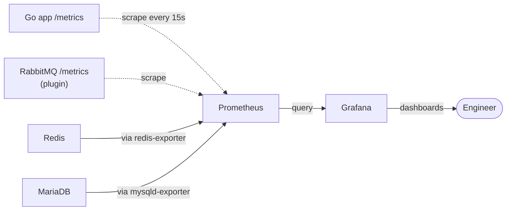

# Observability

Prometheus + Grafana setup. The 4 golden signals dashboard. PromQL idioms that come up repeatedly.

## The three pillars (and what we have)

Production observability has three pillars:

| Pillar | What it gives you | This project uses |
|---|---|---|
| **Logs** | Discrete events ("user X did Y at time Z") | Docker stdout — `docker compose logs` |
| **Metrics** | Numerical aggregates over time ("p95 latency over the last hour") | **Prometheus + Grafana** |
| **Traces** | Cross-service request flow ("this request hit 3 services, here's where it slowed") | Not yet — OpenTelemetry candidate for later |

We focused on metrics because logs alone don't answer "is the app slower than yesterday?" without manual aggregation.

## Architecture



**Pull-based** (Prometheus scrapes you, not the other way around). Each target exposes a `/metrics` HTTP endpoint. Prometheus configured with target list, polls every 15s.

The benefit of pull: targets don't need to know Prometheus exists. Just expose a port. Adding a new instance = adding it to scrape config; no code change.

## What we instrument in the Go app

In [`internal/metrics/metrics.go`](../internal/metrics/metrics.go):

```go
HTTPRequestsTotal      = NewCounterVec({"method", "path", "status"})
HTTPRequestDuration    = NewHistogramVec({"method", "path"})  // bucketed
MessagesProcessed      = NewCounterVec({"queue"})  // worker
MessagesFailed         = NewCounterVec({"queue"})  // worker
```

Plus the Go runtime metrics that come free with `prometheus/client_golang`: goroutines, GC pause distributions, heap size, file descriptors.

### Three metric types you need to know

| Type | Behavior | Example |
|---|---|---|
| **Counter** | Monotonically increasing. Resets only on process restart. | `requests_total` (count of requests ever) |
| **Gauge** | Goes up AND down. Represents current state. | `goroutines_running` (current count) |
| **Histogram** | Distributes values into buckets. Use for percentiles. | `request_duration_seconds` |

**When to use which**:
- Counting things that happen → counter
- Measuring something with a current value (queue depth, memory, connection count) → gauge
- Distribution of values where percentiles matter → histogram

### Why histograms (not summaries)

Both can answer "p95 latency." Histograms aggregate across instances; summaries don't. For multi-instance apps (we have 2 app containers), histograms are the right pick. Summaries are tempting because they compute percentiles client-side (cheaper queries), but they don't merge across instances correctly — you can't average two summaries.

### Bucket boundaries matter

Default Prometheus histogram buckets are tuned for slow services (5ms-10s). A fast Go API needs finer buckets in the low end:

```go
Buckets: []float64{0.001, 0.005, 0.01, 0.025, 0.05, 0.1, 0.25, 0.5, 1, 2.5, 5}
```

If 90% of your requests are sub-10ms and your buckets start at 5ms, your p50 just shows "<5ms" — useless precision. Tune buckets to your actual latency distribution.

### Cardinality discipline

Each unique label combination = one separate time-series. Prometheus stores one float per series per scrape. Bad labels explode storage:

```go
// BAD — user_id has cardinality of all your users
HTTPRequestsTotal.WithLabelValues("GET", "/students", "200", userID).Inc()

// GOOD — path is route template, low cardinality
HTTPRequestsTotal.WithLabelValues("GET", "/students/{id}", "200").Inc()
```

We use `r.Pattern` (Go 1.22+) for the path label, which gives the route template (`/students/{id}`) not the actual URL (`/students/42`). Bounded cardinality.

### Self-exclusion

The metrics middleware excludes `/metrics` from being recorded:

```go
if r.URL.Path == "/metrics" {
    next.ServeHTTP(w, r)
    return
}
```

Otherwise every Prometheus scrape would increment `http_requests_total{path="/metrics"}`, polluting traffic graphs.

## Dashboard — the 4 golden signals

Provisioned via JSON file at `monitoring/grafana/dashboards/golden-signals.json`. Grafana picks it up at startup; reproducible across team members and rebuilds.

| Panel | Metric | Why it matters |
|---|---|---|
| **Traffic** | request rate by path | Are users hitting the system? Where? |
| **Latency** | p50 / p95 / p99 across all paths | Tail latency = user experience |
| **Errors** | 4xx and 5xx rates | Errors = broken features |
| **Saturation** | DB connections, queue depth | When you're going to break next |

These are the 4 that **every service should expose**. Catches ~90% of production issues. Anything missing from this set = blind spot.

We added two extras:
- **Worker rate** — messages processed/failed per second (Step 9 metrics)
- **DB connections by job** — distinguishes primary vs replica saturation

## PromQL idioms that come up constantly

### Per-second rate from a counter

```promql
rate(studentsystemgo_http_requests_total[1m])
```

`rate()` divides the counter increase by the time window. `[1m]` = 1-minute window. At a 15s scrape interval, the rate is computed across 4 samples.

### Aggregation by label

```promql
sum by (path) (rate(studentsystemgo_http_requests_total[1m]))
```

Groups by `path`, sums across the other labels (method, status). Result: one line per path, value = req/s.

### Filtering by label

```promql
studentsystemgo_http_requests_total{status=~"5.."}
```

The `=~` operator does regex matching. `5..` matches `500`, `502`, `503`. Common pattern for "all 5xx errors."

### Error rate as percentage

```promql
sum(rate(http_requests_total{status=~"5.."}[5m]))
  / sum(rate(http_requests_total[5m]))
  * 100
```

Numerator: 5xx rate. Denominator: total rate. Ratio × 100 = percent error rate.

**Watch out for division by zero** when traffic is 0. Guard with:

```promql
(sum(rate(...{status=~"5.."}[5m])) or vector(0))
  / (sum(rate(...[5m])) > 0)
  * 100
```

`or vector(0)` returns 0 if there are no 5xx hits. `> 0` filter on denominator drops periods of zero traffic instead of producing `NaN`.

### Percentiles from histograms

```promql
histogram_quantile(0.95,
  sum by (le) (rate(http_request_duration_seconds_bucket[5m]))
)
```

`histogram_quantile(q, buckets)` interpolates the q-th percentile from histogram buckets. The inner `sum by (le)` aggregates buckets across instances (the cross-instance merge that summaries can't do).

### Splitting by environment

After we wired up `env=prod` and `env=local` external labels:

```promql
sum by (env, path) (rate(http_requests_total[1m]))
```

Lets one panel show prod and local side by side.

## Adding the prod scrape (laptop → EC2)

The full monitoring stack runs on the laptop (RAM-bound on t3.micro). To monitor prod, configure Prometheus to scrape EC2's public `/metrics`:

```yaml
- job_name: studentsystemgo-app-prod
  static_configs:
    - targets: ["13.126.165.62:80"]
      labels:
        env: prod
  metrics_path: /metrics
```

Adds 30-50 ms scrape latency (India → Mumbai), but the data is accurate; just delayed by one round-trip.

**Security caveat**: this means `/metrics` is publicly readable on EC2. Anyone can see request rates, error patterns, internal endpoints. For a learning project, fine. For real production, restrict via:
- nginx allowlist (only your monitoring IP can hit /metrics)
- HTTP Basic Auth on /metrics
- Move /metrics to a separate internal-only port

## What we don't have yet

- **Alerting**: Prometheus has Alertmanager support for fire-and-forget alerts (PagerDuty, Slack, email). Not wired up. Production rule examples we'd add:
  - p95 latency > 500ms for 5 min → page on-call
  - 5xx rate > 1% for 5 min → page
  - Failed queue depth > 0 → email (less urgent)
  - DB connection pool > 80% utilized for 10 min → page

- **Tracing**: OpenTelemetry instrumentation would let us see "which DB query is slow under load?" instead of just "the request was slow." Phase 2 candidate.

- **Log aggregation**: Loki + Grafana would centralize logs alongside metrics. Currently we shell into containers with `docker compose logs`. Fine for a single host; would need centralization at multi-host scale.

## Walking through a real bug

Hypothetical incident, mapped to dashboard panels:

> Users complain the app is slow.

1. **Latency panel** → p95 climbed from 25ms to 800ms in the last hour.
2. **Traffic panel** → request rate looks normal. So it's not a load spike.
3. **Errors panel** → no spike. So it's not failing requests.
4. **Saturation panel** → DB connection count is at 50/50. **Pool exhausted.**
5. SSH in, `SHOW PROCESSLIST` — see one query holding 30+ connections in `Sleep` state. Kill it. Latency drops back.
6. Grep app logs at the time the slow queries started. Find the offending code path.

The dashboard didn't fix the bug, but it **localized the problem in 30 seconds**. Without it: an hour of grepping logs.

That's what observability buys you. Not magic; just visibility.
